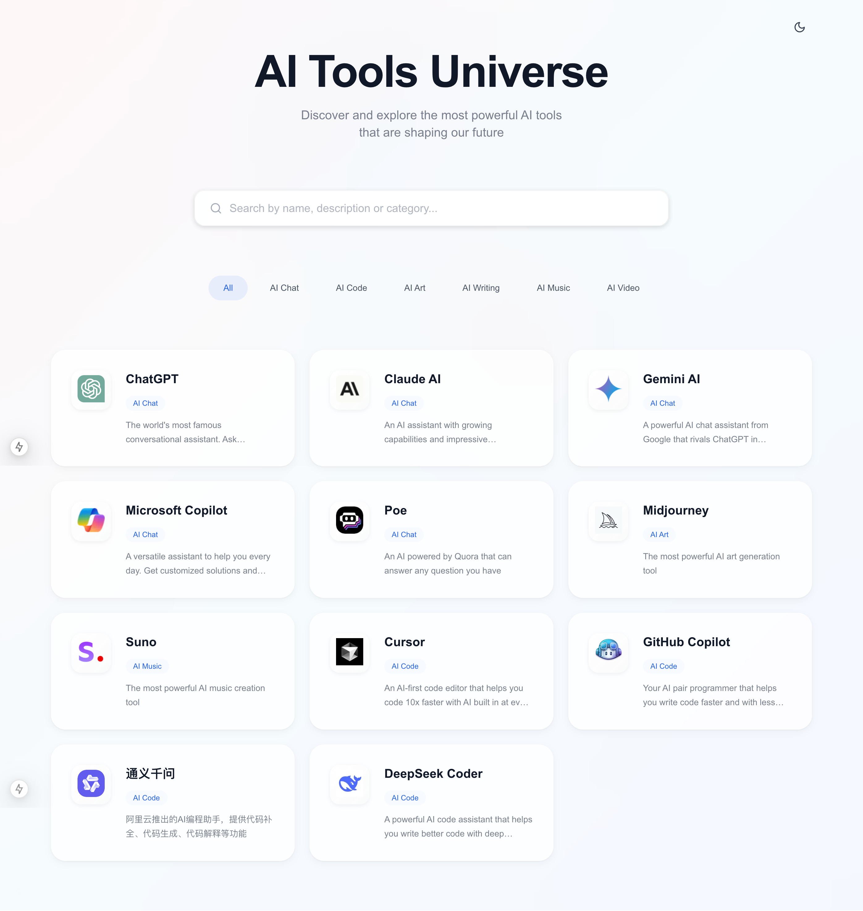

# AI Tools Universe

A modern web application that showcases and helps users discover the most powerful AI tools available today. Built with Next.js 14, TypeScript, and Tailwind CSS.



## Features

- 🎨 Modern and responsive UI design
- 🌓 Light/Dark mode support
- 🔍 Real-time search functionality
- 🏷️ Category-based filtering
- 📱 Mobile-first approach
- 🖼️ Optimized image loading
- ⚡ Fast and performant

## Tech Stack

- [Next.js 15](https://nextjs.org/) - React framework
- [TypeScript](https://www.typescriptlang.org/) - Type safety
- [Tailwind CSS](https://tailwindcss.com/) - Styling
- [Shadcn/ui](https://ui.shadcn.com/) - UI components
- [Lucide Icons](https://lucide.dev/) - Icons

## Getting Started

### Prerequisites

- Node.js 18+
- npm or yarn or pnpm

### Installation

1. Clone the repository:
```bash
git clone https://github.com/Aaronwn/ai-nav.git
cd ai-nav
```

2. Install dependencies:
```bash
npm install
# or
yarn install
# or
pnpm install
```

3. Run the development server:
```bash
npm run dev
# or
yarn dev
# or
pnpm dev
```

4. Open [http://localhost:3000](http://localhost:3000) with your browser to see the result.

### Image Optimization

To optimize tool logos, run:
```bash
npm run optimize-images
# or
yarn optimize-images
# or
pnpm optimize-images
```

## Project Structure

```
ai-tools-universe/
├── app/                    # Next.js app directory
├── components/            # React components
├── public/               # Static assets
│   ├── logos/           # Tool logos
│   └── images/          # Other images
├── scripts/             # Utility scripts
└── styles/             # Global styles
```

## Contributing

1. Fork the repository
2. Create your feature branch (`git checkout -b feature/amazing-feature`)
3. Commit your changes (`git commit -m 'Add some amazing feature'`)
4. Push to the branch (`git push origin feature/amazing-feature`)
5. Open a Pull Request

## License

This project is licensed under the MIT License - see the [LICENSE](LICENSE) file for details.

## Acknowledgments

- Design inspired by Apple and Google's design systems
- Icons from [Lucide Icons](https://lucide.dev/)
- UI components from [Shadcn/ui](https://ui.shadcn.com/)

## Contact

Your Name - [@yourtwitter](https://twitter.com/yourtwitter)

Project Link: [https://github.com/yourusername/ai-tools-universe](https://github.com/yourusername/ai-tools-universe)
